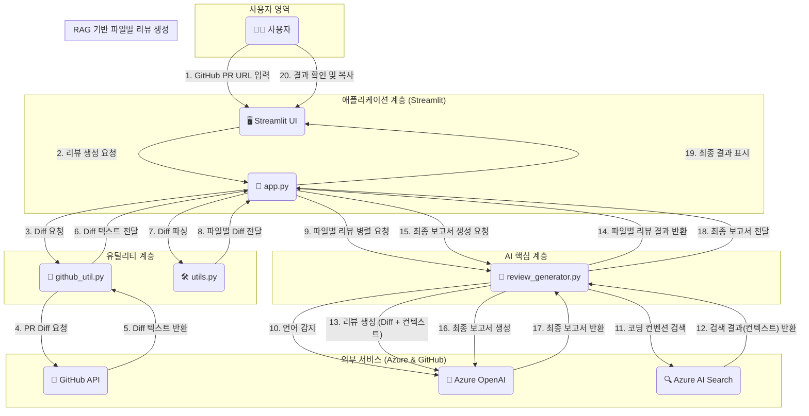

# 🤖 GitHub PR AI 리뷰어 v1.0

# Test App URL
https://sienna-pr-review.azurewebsites.net

## 📝 개요
이 프로젝트는 개발자가 GitHub Pull Request(PR)의 URL을 입력하면, Azure OpenAI Service와 Azure AI Search를 활용하여 코드 변경사항을 분석하고 자동으로 리뷰를 생성해주는 MVP(Minimum Viable Product) 웹 애플리케이션입니다.
단순히 코드의 문제점을 지적하는 것을 넘어, 각 파일의 프로그래밍 언어를 자동으로 감지하고 해당 언어의 코딩 컨벤션을 기반으로 한 분석을 제공합니다. 최종적으로는 PR 전체에 대한 요약 보고서를 생성하여 개발자가 코드의 품질을 개선하고, 리뷰어가 리뷰에 드는 시간을 단축할 수 있도록 돕습니다.

## 🎯 목적
* **코드 리뷰 자동화**: 반복적인 코드 리뷰 작업을 자동화하여 개발 생산성을 향상시킵니다.
* **코드 품질 표준화**: AI가 일관된 기준으로 코딩 컨벤션, 잠재적 버그, 보안 취약점 등을 검토하여 팀의 코드 품질을 상향 평준화합니다.
* **리뷰어 부담 경감**: 리뷰어는 AI가 생성한 1차 리뷰를 바탕으로, 비즈니스 로직과 같은 더 중요한 측면에서 평가합니다.
* **개발자 성장 지원**: AI의 제안과 코드 예시를 통해 개발자는 더 나은 코드를 작성하는 방법을 학습할 수 있습니다.

## 🛠️ 사용된 기술
* **AI / LLM**: Azure OpenAI Service (GPT 모델)
* **검색 (RAG)**: Azure AI Search (벡터 임베딩)
* **웹 프레임워크**: Streamlit
* **프로그래밍 언어**: Python
* **주요 라이브러리**:
    * `requests`: GitHub API 통신
    * `streamlit`: 사용자 인터페이스(UI) 구축
    * `concurrent.futures`: 병렬 처리를 통한 성능 향상

## ✨ 주요 기능
* **GitHub PR 연동**: Github api  해당 PR의 코드 변경사항(`diff`)을 자동으로 가져옵니다.
* **자동 언어 감지**: 코드 변경사항을 분석하여 파일별 프로그래밍 언어를 자동으로 식별합니다.
* **RAG 기반 컨텍스트 강화 리뷰**:
    * Azure AI Search를 통해 해당 언어의 핵심 코딩 컨벤션(변수명, 에러 처리, 보안 등)을 검색합니다.
    * 검색된 컨벤션을 컨텍스트로 활용하여 LLM이 더 정확하고 깊이 있는 리뷰를 생성하도록 합니다 (RAG).
* **병렬 처리**: 여러 파일에 대한 리뷰를 병렬로 처리하여 전체 분석 시간을 단축합니다.
* **구조화된 리뷰 생성**: 각 파일에 대해 보안, 전반적인 인상, 개선 제안(가독성, 버그, 성능 등)을 포함하는 구조화된 리뷰를 제공합니다.
* **최종 종합 보고서**: 모든 파일의 리뷰가 완료되면, 테크 리드의 관점에서 PR 전체를 요약하는 최종 보고서를 생성합니다.
* **인터랙티브 UI**: Streamlit을 사용하여 사용자가 쉽게 PR URL을 입력하고, 실시간 분석 과정을 확인하며, 최종 결과를 볼 수 있는 웹 UI를 제공합니다.
* **결과 복사 기능**: 생성된 최종 보고서를 클립보드에 복사할 수 있습니다.

## 🏗️ 아키텍처
이 시스템은 사용자의 요청부터 최종 리뷰 생성까지 다음과 같은 흐름으로 동작합니다. 각 컴포넌트는 명확히 분리된 역할을 수행하며 유기적으로 상호작용합니다.

**아키텍처 흐름 설명:**
1.  **사용자 요청**: 사용자가 Streamlit으로 만들어진 UI에 GitHub PR URL을 입력합니다.
2.  **Diff 가져오기**: `app.py`는 `github_util.py`를 통해 GitHub API에서 해당 PR의 diff 텍스트를 가져옵니다.
3.  **Diff 파싱**: `utils.py`가 전체 diff 텍스트를 파일별로 분리합니다.
4.  **병렬 리뷰 생성**: `app.py`는 `concurrent.futures`를 사용하여 각 파일의 diff를 `review_generator.py`에 전달하고, 리뷰 생성을 병렬로 처리합니다.
5.  **RAG 프로세스**: `review_generator.py`는 각 파일에 대해 다음을 수행합니다.
    * **언어 감지**: Azure OpenAI를 호출하여 코드의 프로그래밍 언어를 식별합니다.
    * **컨벤션 검색**: 식별된 언어를 키워드로 Azure AI Search를 검색하여 관련된 코딩 컨벤션을 가져옵니다.
    * **리뷰 생성**: 원본 diff와 검색된 컨벤션을 함께 Azure OpenAI에 전달하여 심층적인 리뷰를 생성합니다.
6.  **최종 보고서 생성**: 모든 파일의 리뷰가 완료되면, `review_generator.py`가 개별 리뷰들을 종합하여 최종 요약 보고서를 생성하도록 Azure OpenAI에 다시 요청합니다.
7.  **결과 표시**: `app.py`는 완성된 최종 보고서를 Streamlit UI에 마크다운 형식으로 표시하고, `utils.py`의 함수를 통해 '보고서 복사' 버튼을 제공합니다.

## 📈 기대 효과
* **개발 속도 향상**: 코드 리뷰 대기 시간이 줄어들어 PR이 더 빠르게 머지되고, 전체 개발 사이클이 단축됩니다.
* **품질 일관성 확보**: 모든 코드 변경사항에 대해 일관된 품질 기준을 적용할 수 있습니다.
* **지식 격차 해소**: 주니어 개발자도 시니어 개발자 수준의 피드백을 받으며 빠르게 성장할 수 있습니다.
* **리뷰 문화 개선**: 리뷰어는 단순 스타일 지적에서 벗어나 아키텍처나 로직의 타당성 등 더 본질적인 논의에 집중할 수 있습니다.

## 🧐 구현 시 고려사항
* **프롬프트 엔지니어링**: AI 리뷰의 품질은 전적으로 프롬프트의 완성도에 달려있습니다. `_get_review_prompt`와 `_get_summary_prompt` 함수 내의 시스템 프롬프트를 지속적으로 개선하여 역할(페르소나), 분석 단계, 결과 포맷을 명확히 지시하는 것이 중요합니다.
* **LLM 토큰 제한**: 매우 큰 diff 파일의 경우 LLM의 토큰 제한을 초과할 수 있습니다. 이를 해결하기 위해 `_split_diff_into_chunks` 함수를 구현하여 diff를 hunk 단위로 분할하여 처리합니다.
* **비용 관리**: Azure OpenAI와 AI Search는 API 호출량에 따라 비용이 발생하므로, 프로덕션 환경에서는 사용량을 모니터링하고 비용을 최적화하는 전략이 필요합니다.
* **RAG 데이터 품질**: Azure AI Search에 인덱싱된 코딩 컨벤션 문서의 품질이 리뷰의 정확성에 직접적인 영향을 미칩니다. 신뢰할 수 있고 잘 정리된 문서를 기반으로 인덱스를 구축해야 합니다.
* **보안**: GitHub 토큰, Azure 키와 같은 민감 정보는 `.env` 파일을 통해 안전하게 관리되어야 하며, 코드 상에 하드코딩되지 않도록 주의해야 합니다. AI 리뷰 프롬프트 자체에도 민감 정보 유출을 점검하는 항목을 포함시켰습니다.

## 🗂️ 파일별 설명
* **`app.py`**:
    * Streamlit을 사용하여 웹 애플리케이션의 전체 흐름을 제어하는 메인 파일입니다.
    * 사용자 입력을 받고, 다른 모듈의 함수를 호출하여 리뷰 프로세스를 실행하며, 최종 결과를 UI에 표시합니다.
* **`config.py`**:
    * `.env` 파일에서 GitHub 및 Azure 서비스에 필요한 환경 변수(API 키, 엔드포인트 등)를 로드합니다.
    * Azure OpenAI 및 Azure AI Search 클라이언트 객체를 초기화하여 다른 파일에서 재사용할 수 있도록 제공합니다.
* **`github_util.py`**:
    * GitHub과 관련된 기능을 담당합니다.
    * PR URL에서 소유자, 저장소, PR 번호를 추출하고, GitHub API를 호출하여 PR의 `diff` 내용을 가져오는 함수를 포함합니다.
* **`review_generator.py`**:
    * AI 리뷰 생성의 핵심 로직을 담고 있습니다.
    * 언어 감지, 코딩 컨벤션 검색(RAG), 파일별 리뷰 생성, 최종 요약 보고서 생성 함수를 포함합니다.
    * LLM에 전달할 상세한 시스템 프롬프트를 정의하고 있습니다.
* **`utils.py`**:
    * 프로젝트 전반에서 사용되는 헬퍼 함수들을 모아놓은 파일입니다.
    * 전체 `diff` 텍스트를 파일 단위로 파싱하는 함수와, 최종 보고서를 클립보드에 복사하는 HTML 버튼을 생성하는 함수를 포함합니다.
